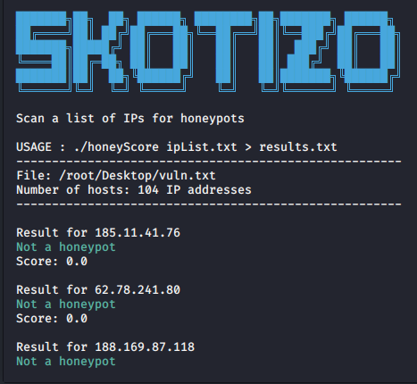

# honeyScore
Scan a list of IP addresses for honeypots using the Shodan CLI
## Installation
```bash
git clone https://github.com/Skotizo/honeyScore
cd honeyScore
chmod +x install.sh
./install.sh
```
## Usage
```bash
./honeyScore ipList.txt 
./honeyScore ipList.txt > results.txt
```
## Output

